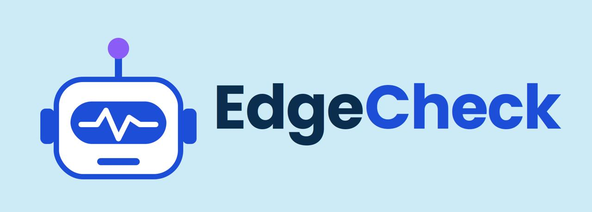

# ⚡ EdgeCheck

### Think you're on the edge of trading? **EdgeCheck yourself.**

> An AI-powered trading strategy analysis platform that turns natural-language trading ideas into structured strategies and evaluates them against real market data.

<p align="center">
  
</p>

<p align="center">
  <strong>Real Market Data • AI Strategy Analysis • Interactive Charts • Secure BYOK AI</strong>
</p>

<p align="center">
  <a href="#features">Features</a> •
  <a href="#how-it-works">How It Works</a> •
  <a href="#architecture">Architecture</a> •
  <a href="#security">Security</a> •
  <a href="#tech-stack">Tech Stack</a> •
  <a href="#roadmap">Roadmap</a>
</p>

---

## 🎯 What is EdgeCheck?

EdgeCheck is an AI-powered trading strategy analysis platform designed to help traders evaluate their strategies against **real market conditions**.

Instead of simply asking an AI:

> "Should I buy this?"

EdgeCheck allows users to define their own trading strategy in natural language.

For example:

> **"Mark the trendline and if the trendline breaks, wait for confirmation and a pullback to the trendline before entering."**

EdgeCheck converts that idea into structured trading rules and evaluates the strategy against real market data.

The goal is not to generate trading signals blindly.

The goal is to help traders **check whether their own strategy is actually present in the current market setup.**

---

# ✨ Features

## 📈 Real Market Charts

EdgeCheck uses real market data instead of generated or simulated candles.

Supported markets currently include:

- NIFTY 50
- NIFTY BANK
- SENSEX
- NIFTY FIN SERVICE
- NIFTY MID SELECT
- INDIA VIX

Supported timeframes:

- 5 minutes
- 15 minutes
- 1 hour
- 1 day

Market data is retrieved server-side and rendered using **Lightweight Charts**.

---

## 🧠 AI-Powered Strategy Understanding

Users can describe their strategy naturally.

Example:

```text
If price breaks the trendline,
wait for confirmation,
then wait for a pullback to the trendline
before entering.
