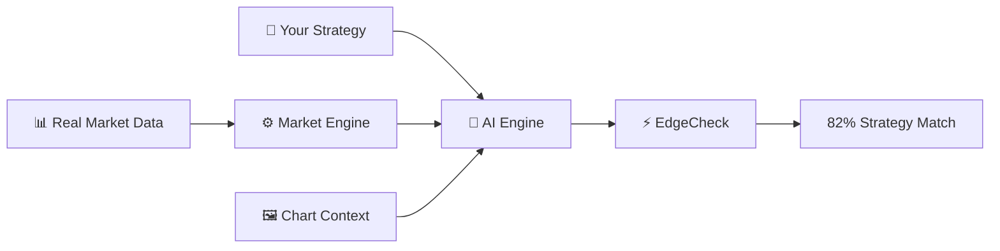
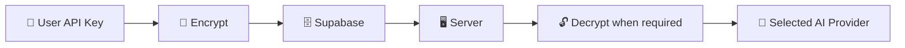
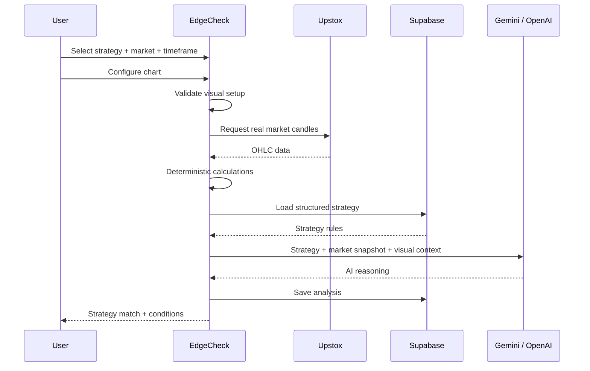

<div align="center">

# ⚡ EdgeCheck

### Think you’re on the edge of trading? **EdgeCheck yourself.**

**AI-powered trading-strategy analysis — built to measure how closely your strategy matches the current market.**

[](https://nextjs.org/)
[](https://react.dev/)
[](https://www.typescriptlang.org/)
[](https://supabase.com/)
[](https://vercel.com/)

**Real Market Data** → **Market Engine** → **Your Strategy** → **AI Engine** → **Strategy Match**

</div>

---

## 🧠 What is EdgeCheck?

EdgeCheck is a **freemium AI SaaS for analyzing trading strategies against the current market setup**.

Instead of asking:

> “Should I buy or sell?”

EdgeCheck asks:

> **“How closely does the current market match my strategy?”**

You describe your strategy in natural language. EdgeCheck turns it into structured rules, combines those rules with **real market data**, validates the visual chart setup, and uses an AI provider to reason about the current compatibility.

### ⚠️ Important

EdgeCheck is **not a trading signal or trade-execution platform**.

It does **not** provide:

- ❌ Buy/sell recommendations
- ❌ Guaranteed entries
- ❌ Stop-loss instructions
- ❌ Take-profit targets
- ❌ Profit probabilities
- ❌ Trade execution

An **82% Strategy Match** means the current market setup is approximately 82% compatible with the defined strategy conditions. It does **not** mean an 82% probability of profit.

---

## ✨ Core Architecture



> **AI interprets the setup. Real market data remains the source of truth.**

---

# 🚀 How It Works

| | Stage | What happens |
|---|---|---|
| **01** | 📡 **Market Data** | Real OHLC data from the market-data layer |
| **02** | ⚙️ **Market Engine** | Deterministic market and indicator calculations |
| **03** | 🧩 **Your Strategy** | Natural language becomes structured rules |
| **04** | 🤖 **AI Engine** | AI reasons across strategy + market context |
| **05** | ⚡ **EdgeCheck** | Measures current strategy compatibility |

```text
Real Market Data
       ↓
Market / Indicator Engine
       ↓
Your Structured Strategy
       ↓
Validated Chart Context
       ↓
Gemini / OpenAI
       ↓
Strategy Match
       ↓
Matched + Missing Conditions
```

---

# 🧠 AI Engine

EdgeCheck currently supports provider-based AI analysis.

| Provider | Model | Availability |
|---|---|---|
| 🟢 Google Gemini | `gemini-3.5-flash-lite` | **Default / Free** |
| ⚫ OpenAI | `gpt-5-mini` | **User BYOK** |

### Provider architecture

```text
                 ┌─────────────────┐
                 │   EdgeCheck AI  │
                 └────────┬────────┘
                          │
                ┌─────────┴─────────┐
                ↓                   ↓
       ┌─────────────────┐  ┌─────────────────┐
       │ Google Gemini   │  │     OpenAI      │
       │ 3.5-flash-lite  │  │    gpt-5-mini   │
       └─────────────────┘  └─────────────────┘
```

### RAG

**RAG is not currently used.**

The current architecture does not include a knowledge-base retrieval layer.

---

# 🔐 BYOK Security

EdgeCheck supports **Bring Your Own Key (BYOK)**.

User-provided AI API keys are:

- 🔒 Encrypted before database storage
- 🛡️ Protected by Supabase Row Level Security
- 🖥️ Handled server-side
- 🚫 Not intended to be exposed to the browser
- 🔑 Decrypted server-side only when required

### Encryption

```text
AES-256-GCM
```

### Key flow



---

# 📈 Real Market Data

EdgeCheck uses **real market data**, not mock candles.

### Provider

**Upstox**

### Supported indices

- NIFTY 50
- NIFTY BANK
- SENSEX
- NIFTY FIN SERVICE
- NIFTY MID SELECT
- INDIA VIX

### Supported timeframes

```text
5m  ·  15m  ·  1h  ·  1d
```

---

# 📊 Charting

EdgeCheck uses **Lightweight Charts** for native market rendering.

```text
REAL OHLC
   ↓
LIGHTWEIGHT CHARTS
   ↓
NATIVE DRAWINGS / INDICATORS
```

AI does **not** redraw or recreate candles.

Exact market and indicator values should come from real market data and deterministic calculations.

---

# ✏️ Chart Drawings

Current drawing architecture supports:

- Horizontal levels
- Trendlines

Drawings are designed to:

- Be created interactively
- Be moved
- Be deleted
- Persist after reload
- Persist deletion
- Belong to the correct user
- Belong to the correct chart setup/timeframe

### Planned

- Fibonacci retracement
- More chart patterns
- Highlighting
- Shape annotations
- More technical-analysis overlays

Drawings are native overlays and should not modify underlying OHLC data.

---

# 👁️ Visual Setup Validation

EdgeCheck uses a hybrid approach.

### Screenshot = visual context

A chart screenshot can help validate requirements such as:

```text
Strategy requires trendline
          ↓
Is a trendline visible?
      ↙       ↘
    YES        NO
     ↓          ↓
 Continue    Ask user to add it
```

For an EMA strategy:

```text
Strategy requires EMA 21
          ↓
Is EMA 21 visible?
      ↙       ↘
    YES        NO
     ↓          ↓
 Continue    Ask user to add it
```

### Exact values = real market engine

```text
Screenshot
    ↓
Visual validation

Real OHLC
    ↓
Deterministic calculations
    ↓
Exact market / indicator values

Both
    ↓
AI reasoning
```

This prevents a vision model from becoming the source of truth for numerical market data.

---

# 🧩 Natural-Language Strategies

Users can describe a strategy naturally.

Example:

```text
MARK TRENDLINE AND IF THE TRENDLINE BREAKS
WAIT FOR CONFIRMATION ALSO PULLBACK TO THE
TRENDLINE THEN ANALYZE THE CURRENT SETUP
```

EdgeCheck converts the idea into structured strategy rules.

```text
Natural Language
       ↓
AI + Zod
       ↓
Structured Rules
       ↓
Supabase PostgreSQL
       ↓
Analysis Engine
```

Vague or incomplete strategies should be rejected or flagged instead of being treated as precise rules.

---

# 🗄️ Data Architecture

EdgeCheck uses **Supabase PostgreSQL**.

```text
┌─────────────────────┐
│       profiles      │
├─────────────────────┤
│ id                  │
│ name                │
│ plan                │
│ ai_provider         │
└──────────┬──────────┘
           │
           ├──────────────────────┐
           ↓                      ↓
┌─────────────────────┐  ┌─────────────────────┐
│     strategies      │  │      analyses       │
├─────────────────────┤  ├─────────────────────┤
│ id                  │  │ id                  │
│ user_id             │  │ user_id             │
│ name                │  │ strategy_id         │
│ description         │  │ timeframe           │
│ rules               │  │ match_percentage    │
└─────────────────────┘  │ matched_conditions  │
                         │ missing_conditions  │
                         │ ai_summary          │
                         └─────────────────────┘

┌─────────────────────┐  ┌─────────────────────┐
│    daily_usage      │  │    user_api_keys    │
├─────────────────────┤  ├─────────────────────┤
│ user_id             │  │ user_id             │
│ usage_date          │  │ provider            │
│ analysis_count      │  │ encrypted key       │
└─────────────────────┘  └─────────────────────┘
```

---

# 🛡️ Authentication & RLS

Authentication is handled through **Supabase Auth**.

Database access uses **Row Level Security (RLS)**.

Core ownership principle:

```sql
auth.uid() = user_id
```

Protected user-specific resources include:

- Profiles
- Strategies
- Analyses
- Daily usage
- User AI keys

---

# 💳 Freemium Model

| | Free | Premium |
|---|---:|---:|
| Strategies | **3** | **25** |
| Analyses / day | **5** | **50** |
| Default AI | Gemini | Advanced capabilities planned |
| BYOK | Supported | Supported |

---

# 🏗️ Tech Stack

### Frontend

```text
Next.js
React
TypeScript
Tailwind CSS
Lightweight Charts
Lucide React
```

### Backend

```text
Next.js Server Routes
Supabase
PostgreSQL
Supabase Auth
```

### AI

```text
Google Gemini
OpenAI
Zod
```

### Market Data

```text
Upstox
```

### Infrastructure

```text
Vercel
GitHub
```

---

# 📁 Project Structure

```text
edgecheck/
│
├── app/
│   ├── api/
│   │   ├── chart/validate/
│   │   ├── market/indices/
│   │   ├── profile/ai-provider/
│   │   ├── settings/validate-api-key/
│   │   └── strategies/
│   │       ├── route.ts
│   │       └── [id]/analyze/
│   │
│   ├── privacy/
│   │   └── page.tsx
│   └── page.tsx
│
├── components/
│   ├── chart/
│   │   └── drawings.ts
│   ├── profile-dropdown.tsx
│   ├── strategy-analysis.tsx
│   └── technical-flow.tsx
│
├── lib/
│   ├── api-key-crypto.ts
│   └── supabase/
│       ├── client.ts
│       └── server.ts
│
├── proxy.ts
├── package.json
└── README.md
```

> The repository evolves over time. Always inspect the current source tree before making implementation changes.

---

# 🔄 Analysis Pipeline



---

# ⚙️ Environment Variables

Current environment configuration includes:

```env
NEXT_PUBLIC_SUPABASE_URL=
NEXT_PUBLIC_SUPABASE_PUBLISHABLE_KEY=

GEMINI_API_KEY=
UPSTOX_ANALYTICS_TOKEN=

API_KEYS_ENCRYPTION_KEY=
```

Never commit:

```text
.env.local
```

Never expose private credentials through:

```text
NEXT_PUBLIC_*
```

---

# 🛠️ Local Development

```bash
git clone https://github.com/Itzmeharsh/edgecheck.git
cd edgecheck
npm install
```

Create `.env.local` with the required environment variables.

Start development:

```bash
npm run dev
```

Open:

```text
http://localhost:3000
```

### Production build

```bash
npm run build
```

---

# 🚀 Deployment

EdgeCheck is deployed using **Vercel** and the source repository is hosted on GitHub.

Repository:

**https://github.com/Itzmeharsh/edgecheck**

Deployment flow:

```text
Local changes
     ↓
npm run build
     ↓
git add
     ↓
git commit
     ↓
git push origin master
     ↓
GitHub
     ↓
Vercel
     ↓
Production
```

---

# 🔒 Security Notes

Security checks performed include:

- `.env.local` is ignored and not tracked
- No hardcoded API secrets
- Server-only secrets
- Supabase RLS
- Authenticated API routes
- Encrypted BYOK storage
- Production build verification

### Known limitation

Daily analysis usage increment is currently **not atomic**.

A simultaneous burst of requests could theoretically create a race around the daily usage counter. Atomic enforcement can be added later through a database-side operation.

---

# 🗺️ Roadmap

### Charting

- [x] Real OHLC market chart
- [x] Lightweight Charts
- [x] Horizontal levels
- [x] Trendlines
- [x] Persistent drawings
- [ ] Fibonacci retracement
- [ ] More technical drawing tools
- [ ] More indicators

### AI

- [x] Natural-language strategies
- [x] Structured strategy rules
- [x] Gemini
- [x] OpenAI BYOK
- [x] Provider switching
- [x] Visual setup validation
- [ ] Deeper premium analysis
- [ ] Additional providers

### Platform

- [x] Supabase Auth
- [x] PostgreSQL
- [x] RLS
- [x] Free usage limits
- [x] Premium architecture
- [x] Privacy Policy
- [ ] Stripe subscription flow
- [ ] Upstox OAuth/user connection
- [ ] Atomic usage enforcement

---

# 🧭 Product Principles

| 🧠 Strategy First | 📊 Real Data | 🤖 AI Reasoning | 🔐 Security | ⚡ Clarity |
|---|---|---|---|---|
| Your strategy defines the rules | Market data stays authoritative | AI interprets the setup | Keys stay protected | Match ≠ profit probability |

---

# ⚠️ Disclaimer

EdgeCheck provides AI-assisted analysis of trading strategies and market conditions for informational and educational purposes.

A strategy match score is **not** a guarantee of trading performance, profitability, or future market behavior.

EdgeCheck does not provide guaranteed trading signals, financial advice, or trade execution.

Users are responsible for their own trading and investment decisions.

---

# 📬 Contact

For privacy-related requests:

**harshbroyt@gmail.com**

---

<div align="center">

## ⚡ EdgeCheck

### **Think you’re on the edge of trading? EdgeCheck yourself.**

**Real Data. Structured Strategies. AI Reasoning.**

Built with **Next.js · Supabase · Upstox · Gemini · OpenAI**

</div>
